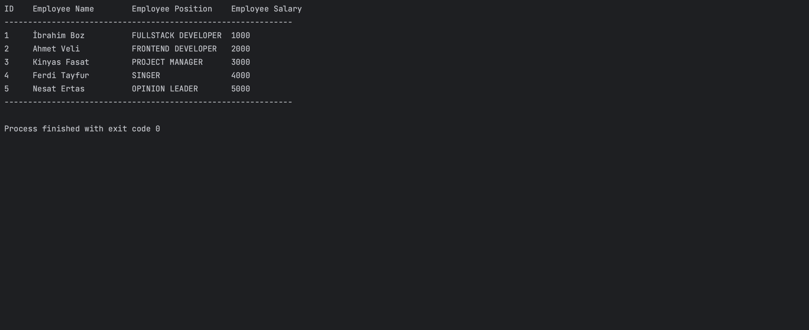

# Database application with JDBC

In this project, after adding data to our sql table and connecting it with java, we printed our data set on the screen.

# Technologies used

<table>
  <tr>
    <td align="center" >
      <b>JAVA</b>
    </td>
    <td align="center" style="padding-top: 15px;">
      
    </td>
  </tr>
 <tr>
    <td align="center" >
      <b>SQL</b>
    </td>
    <td align="center" style="padding-top: 15px;">
      
    </td>
  </tr>
</table>

# Preview
